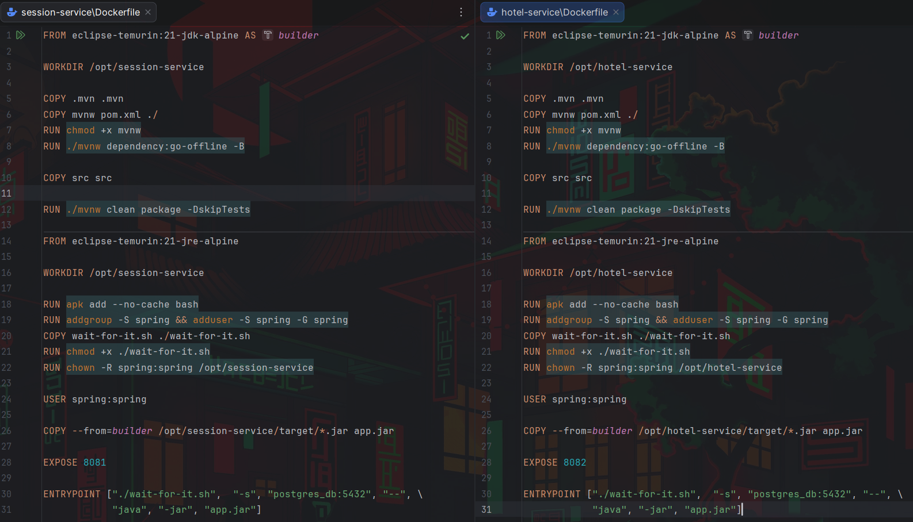
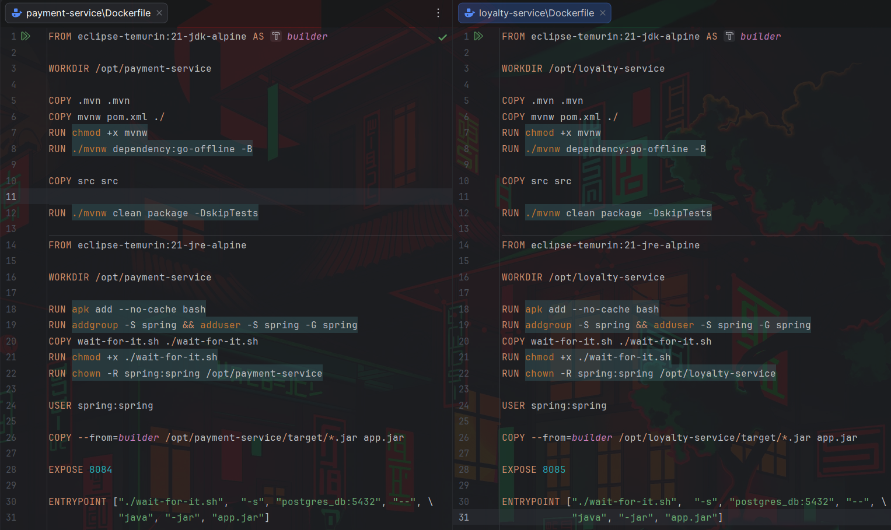
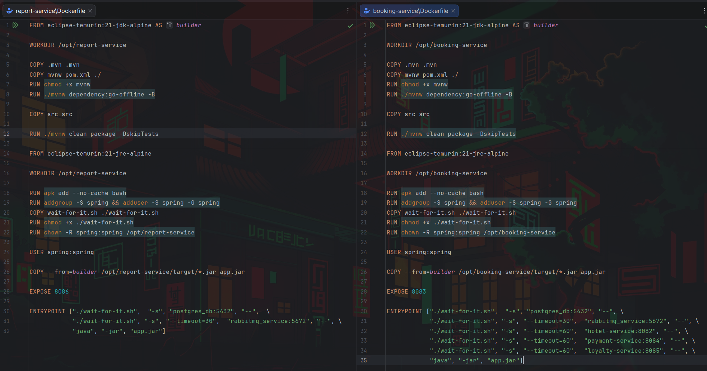
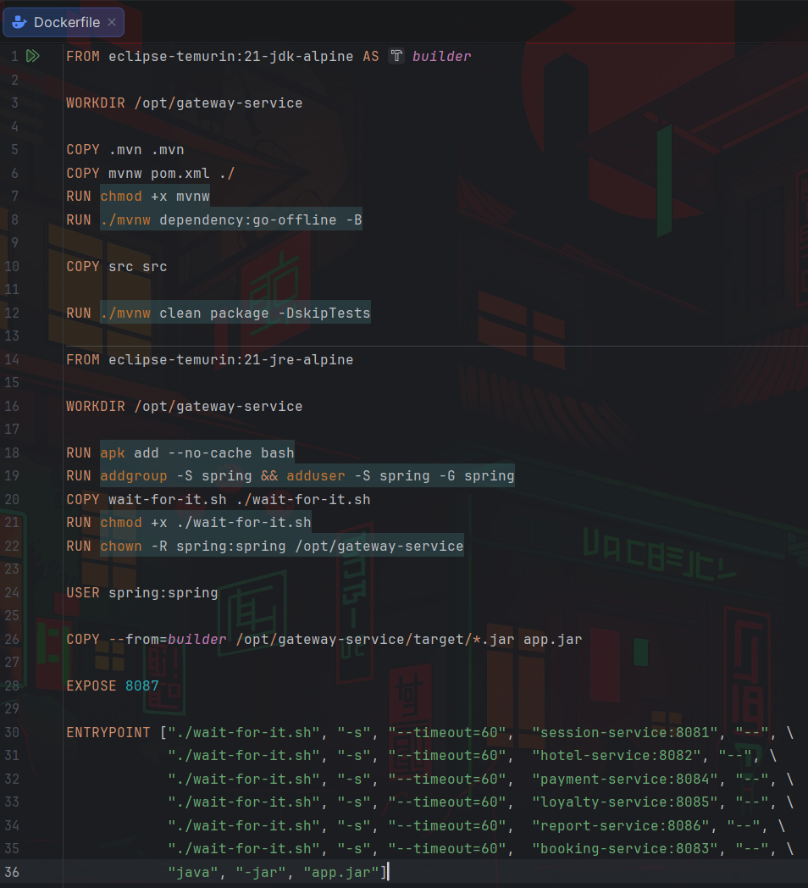
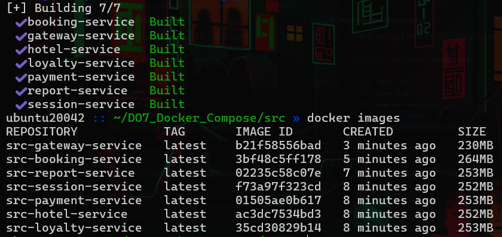
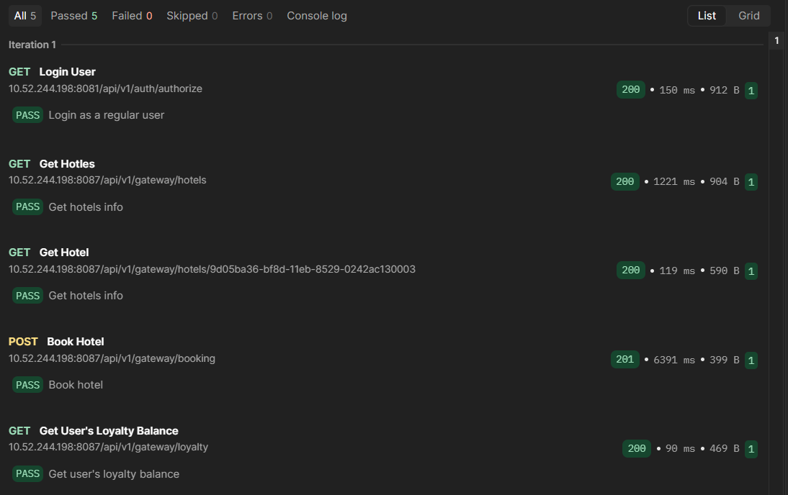

<!-- TOC -->
* [Part 1.](#part-1)
  * [Локальный запуск сервисов](#локальный-запуск-сервисов)
  * [Использование докер для запуска сервисов](#использование-докер-для-запуска-сервисов)
  * [Оптимизация образов и сборка с помощью docker compose](#оптимизация-образов-и-сборка-с-помощью-docker-compose)
<!-- TOC -->

# Part 1.

## Локальный запуск сервисов

1. Написал [docker-compose.yml](docker-compose.yml), где задекларировал 2 контейнера:
    - **postgres_db** от образа `postgres:13` с инициализацией баз [init.sql](services/database/init.sql), с пользователем
      **postgres** от лица которого сервисы будут заполнять эти бд и проброшенным портом `5432`

    - **rabbitmq_service** от образа `rabbitmq:3-management-alpine`, с пользователем и паролем **guest**,
      так же с проброшенным портом `5672` для сервиса и `15672` для админ-панели

    - завязал их в общую сеть `backend`
    - задекларировал том `postgres_data` для сохранения данных бд в случае перезапуска

```yaml
services:
  postgres:
    container_name: postgres_db
    image: postgres:13
    environment:
      POSTGRES_USER: postgres
      POSTGRES_PASSWORD: password
    ports:
      - "5432:5432"
    volumes:
      - postgres_data:/var/lib/postgresql/data
      - ./services/database/init.sql:/docker-entrypoint-initdb.d/init.sql
    networks:
      - backend

  rabbitmq:
    container_name: rabbitmq_service
    image: rabbitmq:3-management-alpine
    ports:
      - "5672:5672"
      - "15672:15672"
    environment:
      RABBITMQ_DEFAULT_USER: guest
      RABBITMQ_DEFAULT_PASS: guest
    networks:
      - backend

volumes:
  postgres_data:

networks:
  backend:
```

2. Запустил контейнеры командой `docker compose up -d`

3. Установил актуальную версию **JVM** и **JDK** командой `sudo apt install default-jdk`

4. Установил менеджер процессов **pm2** *(Process Manager 2)*, для начальной безконтейнерной сборки сервисов.

5. Изучил документацию [04-project_rus.md](../materials/04-project_rus.md), общую архитектуру
   и необходимый набор переменных окружения для запуска каждого сервиса.

6. Используя менеджер пакетов **Maven** и его обертки **mvnw**, находясь в директориях с каждым [сервисом](services), выполнил команду `./mvnw package -DskipTests`

7. Убедился в создании директорий `target/` со всеми зависимостями.


8. Поочередно запустил каждый сервис *(находясь в соответствующих директориях)* с помощью менеджера процессов **pm2**:
- **session_service**:
```bash
pm2 start "POSTGRES_HOST=localhost POSTGRES_PORT=5432 POSTGRES_USER=postgres POSTGRES_PASSWORD=password POSTGRES_DB=users_db java -jar target/*.jar" --name "session_service"
```
- **hotel_service**:
```bash
pm2 start "POSTGRES_HOST=localhost POSTGRES_PORT=5432 POSTGRES_USER=postgres POSTGRES_PASSWORD=password POSTGRES_DB=hotels_db java -jar target/*.jar" --name "hotel_service"
```
- **payment_service**:
```bash
pm2 start "POSTGRES_HOST=localhost POSTGRES_PORT=5432 POSTGRES_USER=postgres POSTGRES_PASSWORD=password POSTGRES_DB=payments_db java -jar target/*.jar" --name "payment_service"
```
- **loyalty_service**:
```bash
pm2 start "POSTGRES_HOST=localhost POSTGRES_PORT=5432 POSTGRES_USER=postgres POSTGRES_PASSWORD=password POSTGRES_DB=balances_db java -jar target/*.jar" --name "loyalty_service"
```
- **report_service**:
```bash
pm2 start "POSTGRES_HOST=localhost POSTGRES_PORT=5432 POSTGRES_USER=postgres POSTGRES_PASSWORD=password POSTGRES_DB=statistics_db RABBIT_MQ_HOST=localhost RABBIT_MQ_PORT=5672 RABBIT_MQ_USER=guest RABBIT_MQ_PASSWORD=guest RABBIT_MQ_QUEUE_NAME=messagequeue RABBIT_MQ_EXCHANGE=messagequeue-exchange java -jar target/*.jar" --name "report_service"
```
- **booking_service**:
```bash
pm2 start "POSTGRES_HOST=localhost POSTGRES_PORT=5432 POSTGRES_USER=postgres POSTGRES_PASSWORD=password POSTGRES_DB=reservations_db RABBIT_MQ_HOST=localhost RABBIT_MQ_PORT=5672 RABBIT_MQ_USER=guest RABBIT_MQ_PASSWORD=guest RABBIT_MQ_QUEUE_NAME=messagequeue RABBIT_MQ_EXCHANGE=messagequeue-exchange HOTEL_SERVICE_HOST=localhost HOTEL_SERVICE_PORT=8082 PAYMENT_SERVICE_HOST=localhost PAYMENT_SERVICE_PORT=8084 LOYALTY_SERVICE_HOST=localhost LOYALTY_SERVICE_PORT=8085 java -jar target/*.jar" --name "booking_service"
```
- **gateway_service**:
```bash
pm2 start "SESSION_SERVICE_HOST=localhost SESSION_SERVICE_PORT=8081 HOTEL_SERVICE_HOST=localhost HOTEL_SERVICE_PORT=8082 BOOKING_SERVICE_HOST=localhost BOOKING_SERVICE_PORT=8083 PAYMENT_SERVICE_HOST=localhost PAYMENT_SERVICE_PORT=8084 LOYALTY_SERVICE_HOST=localhost LOYALTY_SERVICE_PORT=8085 REPORT_SERVICE_HOST=localhost REPORT_SERVICE_PORT=8086 java -jar target/*.jar" --name "gateway_service"
```


>  Запущенные сервисы через **Process Manager 2**:
>
> 
>

9. Установил и запустил **Postman**:
   - Импортировал [коллекцию](application_tests.postman_collection.json)
   - Адаптировал коллекцию для работы, указав ip-адрес VM.
   - Запустил тесты нажав `Run` в верхнем правом углу и удостоверился, что все они прошли успешно.

>  Успешно завершенные тесты в **Postman**:
>
> 
>

- После остановил контейнеры **postgres_db** и **rabbitmq_service** командой `docker compose down -v`
- и запущенные сервисы в **pm2** командой `pm2 delete {0..6}`

---

## Использование докер для запуска сервисов

- Написал базовый **Dockerfile** для каждого сервиса

>
> 
>

- Разбор **Dockerfile** на примере **session-service**:

```dockerfile
# берем легковесный образ Alpine Linux с установленным JDK 21
FROM eclipse-temurin:21-jdk-alpine

# создаем внутри контейнера рабочую директорию /opt/session-service
WORKDIR /opt/session-service

# копируем директорию .mvn с настройками Maven Wrapper в рабочую директорию
COPY .mvn .mvn
# копируем исполняемый файл сборщика mvnw и файл конфигурации зависимостей pom.xml в рабочую директорию
COPY mvnw pom.xml ./
# выдаем докеру права на исполнение файла mvnw
RUN chmod +x mvnw
# запускаем mvnw, который скачивает все сторонние зависимости из интернета
RUN ./mvnw dependency:go-offline

# копируем директорию src с исходным кодом java-сервиса в рабочую директорию контейнера
COPY src src

# запускаем компиляцию
# maven компилирует код и упаковывает его в готовый jar-файл внутри директории target/
# флаг -DskipTests отключает тесты для ускорения процесса
RUN ./mvnw package -DskipTests

# документируем, что session-service внутри контейнера слушает порт 8081
EXPOSE 8081

# запускаем java-сервис внутри контейнера
ENTRYPOINT ["sh", "-c", "java -jar target/*.jar"]
```

- Создал тестовые образы на базе текущих докерфайлов:
   - находясь в директории [services](services) выполнил команды:

```bash
docker build -t session-service-test session-service/
```

```bash
docker build -t hotel-service-test hotel-service/
```

```bash
docker build -t booking-service-test booking-service/
```

```bash
docker build -t payment-service-test payment-service/
```

```bash
docker build -t loyalty-service-test loyalty-service/
```

```bash
docker build -t report-service-test report-service/
```

```bash
docker build -t gateway-service-test gateway-service/
```

>  Размер собранных образов в текущей сборке:
>
> 
>

- Запустил контейнеры **postgres_db** и **rabbitmq_service** командой `docker compose up -d`

- Запустил каждый контейнер с сервисами по отдельности командами:


- **session-service**:
```bash
docker run --rm -p 8081:8081 -e POSTGRES_HOST=postgres_db -e POSTGRES_PORT=5432 -e POSTGRES_USER=postgres -e POSTGRES_PASSWORD=password -e POSTGRES_DB=users_db --network src_backend --name session-service -d session-service-test
```
- **hotel-service**:
```bash
docker run --rm -e POSTGRES_HOST=postgres_db -e POSTGRES_PORT=5432 -e POSTGRES_USER=postgres -e POSTGRES_PASSWORD=password -e POSTGRES_DB=hotels_db --network src_backend --name hotel-service -d hotel-service-test
```
- **payment-service**:
```bash
docker run --rm -e POSTGRES_HOST=postgres_db -e POSTGRES_PORT=5432 -e POSTGRES_USER=postgres -e POSTGRES_PASSWORD=password -e POSTGRES_DB=payments_db --network src_backend --name payment-service -d payment-service-test
```
- **loyalty-service**:
```bash
docker run --rm -e POSTGRES_HOST=postgres_db -e POSTGRES_PORT=5432 -e POSTGRES_USER=postgres -e POSTGRES_PASSWORD=password -e POSTGRES_DB=balances_db --network src_backend --name loyalty-service -d loyalty-service-test
```
- **report-service**:
```bash
docker run --rm -e POSTGRES_HOST=postgres_db -e POSTGRES_PORT=5432 -e POSTGRES_USER=postgres -e POSTGRES_PASSWORD=password -e POSTGRES_DB=statistics_db -e RABBIT_MQ_HOST=rabbitmq_service -e RABBIT_MQ_PORT=5672 -e RABBIT_MQ_USER=guest -e RABBIT_MQ_PASSWORD=guest -e RABBIT_MQ_QUEUE_NAME=messagequeue -e RABBIT_MQ_EXCHANGE=messagequeue-exchange --network src_backend --name report-service -d report-service-test
```
- **booking-service**:
```bash
docker run --rm -e POSTGRES_HOST=postgres_db -e POSTGRES_PORT=5432 -e POSTGRES_USER=postgres -e POSTGRES_PASSWORD=password -e POSTGRES_DB=reservations_db -e RABBIT_MQ_HOST=rabbitmq_service -e RABBIT_MQ_PORT=5672 -e RABBIT_MQ_USER=guest -e RABBIT_MQ_PASSWORD=guest -e RABBIT_MQ_QUEUE_NAME=messagequeue -e RABBIT_MQ_EXCHANGE=messagequeue-exchange -e HOTEL_SERVICE_HOST=hotel-service -e HOTEL_SERVICE_PORT=8082 -e PAYMENT_SERVICE_HOST=payment-service -e PAYMENT_SERVICE_PORT=8084 -e LOYALTY_SERVICE_HOST=loyalty-service -e LOYALTY_SERVICE_PORT=8085 --network src_backend --name booking-service -d booking-service-test
```
- **gateway-service**:
```bash
docker run --rm -p 8087:8087 -e SESSION_SERVICE_HOST=session-service -e SESSION_SERVICE_PORT=8081 -e HOTEL_SERVICE_HOST=hotel-service -e HOTEL_SERVICE_PORT=8082 -e BOOKING_SERVICE_HOST=booking-service  -e BOOKING_SERVICE_PORT=8083 -e PAYMENT_SERVICE_HOST=payment-service -e PAYMENT_SERVICE_PORT=8084 -e LOYALTY_SERVICE_HOST=loyalty-service -e LOYALTY_SERVICE_PORT=8085 -e REPORT_SERVICE_HOST=report-service -e REPORT_SERVICE_PORT=8086 --network src_backend --name gateway-service -d gateway-service-test
```


- Т.к. в текущих конфигурациях **Dockerfile** мы не использовали скрипт `wait-for-it.sh`, то после запуска каждого контейнера ожидаем, пока каждый из них настраивает внутренние процессы, перед запуском следующего

>  Успешный запуск **session-service**:
>
> 
>

>  Успешный запуск **hotel-service**:
>
> 
>

>  Успешный запуск **payment-service**:
>
> 
>

>  Успешный запуск **loyalty-service**:
>
> 
>

>  Успешный запуск **report-service**:
>
> 
>

>  Успешный запуск **booking-service**:
>
> 
>

>  Успешный запуск **gateway-service**:
>
> 
>

- Запустил тесты в **Postman** и удостоверился, что все они прошли успешно.

>  Успешно завершенные тесты в **Postman**:
>
> 
>

>  Логи сервиса **gateway** во время тестов:
>
> 
>

>  Внесенные изменения в таблицу **payments** после тестов:
>
> 
>
> 
>

- Остановил контейнеры с бд и брокером сообщений командой `docker compose down -v`
- Остановил все контейнеры с сервисами `docker stop $(docker ps -q)`
- Удалил созданную докер сеть `docker network rm src_backend`
- Для полной очистки докера, безвозвратно удалив все неиспользуемые контейнеры, сети, образы и тома данных можно использовать `sudo docker system prune -a --volumes -f` *(осторожно)*

---

## Оптимизация образов и сборка с помощью docker compose

- Модифицировал **Dockerfile** для каждого сервиса

>
> 
>
> 
>
> 
>
> 
>

- Разбор **Dockerfile** на примере **gateway-service**:

```dockerfile
# берем легковесный образ Alpine Linux с установленным JDK 21 и называем этап builder
FROM eclipse-temurin:21-jdk-alpine AS builder

# создаем внутри контейнера рабочую директорию /opt/gateway-service
WORKDIR /opt/gateway-service

# копируем директорию .mvn с настройками Maven Wrapper в рабочую директорию
COPY .mvn .mvn
# копируем исполняемый файл сборщика mvnw и файл конфигурации зависимостей pom.xml в рабочую директорию
COPY mvnw pom.xml ./
# выдаем докеру права на исполнение файла mvnw
RUN chmod +x mvnw
# запускаем mvnw, который скачивает все сторонние зависимости из интернета, флаг -B отключает интерактивный режим и лишние логи
RUN ./mvnw dependency:go-offline -B

# копируем директорию src с исходным кодом java-сервиса в рабочую директорию контейнера
COPY src src

# запускаем компиляцию
# maven очищает старые файлы сборки (mode clean), компилирует новый код и упаковывает его в готовый jar-файл внутри директории target/
# флаг -DskipTests отключает тесты для ускорения процесса
RUN ./mvnw clean package -DskipTests

# финальный образ для запуска (runtime)
# берем чистый образ Alpine, но уже с JRE (только среда выполнения java, без компилятора). это сэкономит сотни мегабайт и закроет дыры в безопасности
FROM eclipse-temurin:21-jre-alpine

# создаем чистую рабочую директорию для запуска сервиса
WORKDIR /opt/gateway-service

# устанавливаем командную оболочку bash
# в alpine по умолчанию используется только sh, а скрипт wait-for-it.sh написан под синтаксис bash
# флаг --no-cache не сохраняет временные файлы установки, уменьшая вес образа
RUN apk add --no-cache bash
# создаем в системе изолированную группу spring и системного пользователя spring
# это нужно, чтобы не запускать приложение с root правами
RUN addgroup -S spring && adduser -S spring -G spring
# копируем скрипт ожидания в финальный образ контейнера
COPY wait-for-it.sh ./wait-for-it.sh
# делам скрипт wait-for-it.sh исполняемым
RUN chmod +x ./wait-for-it.sh
# рекурсивно меняем владельца всей рабочей директории на созданного пользователя spring
RUN chown -R spring:spring /opt/gateway-service

# переключаем контекст безопасности docker
# все последующие команды будут выполняться от имени spring
USER spring:spring

# забираем скомпилированный jar-файл из папки target первого этапа (builder) и копирует его сюда под коротким именем app.jar
# весь исходный код и кэш maven остаются в первом образе и отбрасывается
COPY --from=builder /opt/gateway-service/target/*.jar app.jar

# документирует, что gateway-service внутри контейнера слушает порт 8087
EXPOSE 8087

ENTRYPOINT ["./wait-for-it.sh", "-s", "--timeout=60", "session-service:8081", "--", \
            "./wait-for-it.sh", "-s", "--timeout=60", "hotel-service:8082", "--", \
            "./wait-for-it.sh", "-s", "--timeout=60", "payment-service:8084", "--", \
            "./wait-for-it.sh", "-s", "--timeout=60", "loyalty-service:8085", "--", \
            "./wait-for-it.sh", "-s", "--timeout=60", "report-service:8086", "--", \
            "./wait-for-it.sh", "-s", "--timeout=60", "booking-service:8083", "--", \
            "java", "-jar", "app.jar"]
```

*Цепочка запуска `ENTRYPOINT ["./wait-for-it.sh", "-s", "--timeout=60", "session-service:8081", "--", ... ]`
задает единую стартовую команду контейнера, которая работает по принципу матрешки:
контейнер стартует и запускает первый `wait-for-it.sh`, он блокирует запуск и ждет, пока поднимется `session-service` на порту `8081`
(timeout по умолчанию - **15 секунд**, если не указать параметр `--timeout=...`). Как только сервис доступен, первый скрипт через разделитель `--` передает управление
второму `wait-for-it.sh`, тот начинает ждать следующий сервис `hotel-service:8082` в течение максимум 60 секунд и так далее...
И только когда вся цепочка необходимых микросервисов для запуска подтвердила готовность, седьмой скрипт выполняет финальную команду `java -jar app.jar`, запуская сам сервис шлюз.*

- Модифицировал [docker-compose.yml](docker-compose.yml), описывающий конфигурацию и запуск микросервисов с их зависимостями, портами, переменными окружения и сетевой связанностью.

<details>
  <summary>Разбор docker-compose.yml (нажать, чтобы развернуть)</summary>

```yaml
services:
   postgres:
      container_name: postgres_db  # фиксированное имя контейнера для обращения из других сервисов
      image: postgres:13 # использование готового официального образа PostgreSQL версии 13
      environment:
         POSTGRES_USER: postgres # имя суперпользователя БД
         POSTGRES_PASSWORD: password # пароль для доступа к БД
      ports:
         - "5432:5432" # проброс порта наружу (хост:контейнер) для подключения с хоста
      volumes:
         - postgres_data:/var/lib/postgresql/data # монтирование тома для сохранения данных на жестком диске хоста
         - ./services/database/init.sql:/docker-entrypoint-initdb.d/init.sql # скрипт автоматической инициализации баз при первом старте
      networks:
         - backend # подключение к общей сети backend

   rabbitmq:
      container_name: rabbitmq_service # имя контейнера брокера для report-service и booking-service
      image: rabbitmq:3-management-alpine # легковесный образ RabbitMQ с веб-панелью управления (management plugin)
      ports:
         - "5672:5672" # порт для обмена сообщениями по протоколу AMQP
         - "15672:15672" # порт для доступа к веб-интерфейсу администрирования
      environment:
         RABBITMQ_DEFAULT_USER: guest # логин для подключения к RabbitMQ
         RABBITMQ_DEFAULT_PASS: guest # пароль для подключения к RabbitMQ
      networks:
         - backend # подключение к общей сети backend

   session-service:
      container_name: session-service
      build: ./services/session-service # сборка кастомного образа из Dockerfile в указанной директории
      ports:
         - "8081:8081" # публикация порта наружу
      environment:
         POSTGRES_HOST: postgres_db
         POSTGRES_PORT: 5432
         POSTGRES_USER: postgres
         POSTGRES_PASSWORD: password
         POSTGRES_DB: users_db # имя конкретной БД для этого сервиса
      networks:
         - backend
      depends_on:
         - postgres # очередность запуска: старт после инициализации контейнера postgres

 # сервисы hotel, payment, loyalty имеют идентичную конфигурацию инфраструктуры, но работают со своими изолированными базами данных:

   hotel-service:
      container_name: hotel-service
      build: ./services/hotel-service
      environment:
         POSTGRES_HOST: postgres_db
         POSTGRES_PORT: 5432
         POSTGRES_USER: postgres
         POSTGRES_PASSWORD: password
         POSTGRES_DB: hotels_db
      networks:
         - backend
      depends_on:
         - postgres

   payment-service:
      container_name: payment-service
      build: ./services/payment-service
      environment:
         POSTGRES_HOST: postgres_db
         POSTGRES_PORT: 5432
         POSTGRES_USER: postgres
         POSTGRES_PASSWORD: password
         POSTGRES_DB: payments_db
      networks:
         - backend
      depends_on:
         - postgres

   loyalty-service:
      container_name: loyalty-service
      build: ./services/loyalty-service
      environment:
         POSTGRES_HOST: postgres_db
         POSTGRES_PORT: 5432
         POSTGRES_USER: postgres
         POSTGRES_PASSWORD: password
         POSTGRES_DB: balances_db
      networks:
         - backend
      depends_on:
         - postgres

   report-service: # сервис отчетов
      container_name: report-service
      build: ./services/report-service
      environment:
         POSTGRES_HOST: postgres_db
         POSTGRES_PORT: 5432
         POSTGRES_USER: postgres
         POSTGRES_PASSWORD: password
         POSTGRES_DB: statistics_db # своя база данных для хранения статистики
         RABBIT_MQ_HOST: rabbitmq_service # адрес брокера сообщений для подписки на события
         RABBIT_MQ_PORT: 5672
         RABBIT_MQ_USER: guest
         RABBIT_MQ_PASSWORD: guest
         RABBIT_MQ_QUEUE_NAME: messagequeue # имя обрабатываемой очереди
         RABBIT_MQ_EXCHANGE: messagequeue-exchange # точка обмена для маршрутизации сообщений
      networks:
         - backend
      depends_on:
         - postgres # ждет готовности базы данных
         - rabbitmq # ждет готовности брокера сообщений

   booking-service: # сервис бронирования
      container_name: booking-service
      build: ./services/booking-service
      environment:
         POSTGRES_HOST: postgres_db
         POSTGRES_PORT: 5432
         POSTGRES_USER: postgres
         POSTGRES_PASSWORD: password
         POSTGRES_DB: reservations_db # база данных для учета бронирований
         RABBIT_MQ_HOST: rabbitmq_service
         RABBIT_MQ_PORT: 5672
         RABBIT_MQ_USER: guest
         RABBIT_MQ_PASSWORD: guest
         RABBIT_MQ_QUEUE_NAME: messagequeue
         RABBIT_MQ_EXCHANGE: messagequeue-exchange
         HOTEL_SERVICE_HOST: hotel-service # адрес сервиса отелей для выполнения синхронных HTTP/gRPC запросов
         HOTEL_SERVICE_PORT: 8082
         PAYMENT_SERVICE_HOST: payment-service # адрес сервиса оплаты
         PAYMENT_SERVICE_PORT: 8084
         LOYALTY_SERVICE_HOST: loyalty-service # адрес сервиса лояльности
         LOYALTY_SERVICE_PORT: 8085
      networks:
         - backend
      depends_on:
         #  сервис не запустится, пока не поднимутся все его зависимости:
         - postgres
         - rabbitmq
         - hotel-service
         - payment-service
         - loyalty-service

   gateway-service: # шлюз (единая точка входа)
      container_name: gateway-service
      build: ./services/gateway-service
      ports:
         - "8087:8087" # главный внешний порт всей системы для клиентов (фронтенд/API)
      environment:
         #  проброс адресов и портов абсолютно всех микросервисов системы для маршрутизации внешних запросов:
         SESSION_SERVICE_HOST: session-service
         SESSION_SERVICE_PORT: 8081
         HOTEL_SERVICE_HOST: hotel-service
         HOTEL_SERVICE_PORT: 8082
         BOOKING_SERVICE_HOST: booking-service
         BOOKING_SERVICE_PORT: 8083
         PAYMENT_SERVICE_HOST: payment-service
         PAYMENT_SERVICE_PORT: 8084
         LOYALTY_SERVICE_HOST: loyalty-service
         LOYALTY_SERVICE_PORT: 8085
         REPORT_SERVICE_HOST: report-service
         REPORT_SERVICE_PORT: 8086
      networks:
         - backend
      depends_on:
         # контейнер шлюза стартует самым последним, когда все сервисы запущены
         - session-service
         - hotel-service
         - booking-service
         - payment-service
         - loyalty-service
         - report-service

volumes:
   postgres_data: # именованый том для постоянного хранения данных БД (чтобы данные не пропадали при перезапуске)

networks:
   backend: # единая изолированная сеть, в которой микросервисы видят друг друга по именам контейнеров

```

</details>

- Сбилдил новые образы командой `docker compose build`

>  Размер собранных образов в новой сборке:
>
> 
>

- Запустил все сервисы командой `docker compose up -d` и прогнал тесты:

>  Успешно завершенные тесты в **Postman**:
>
> 
>

- Остановил все контейнеры командой `docker compose down -v`
